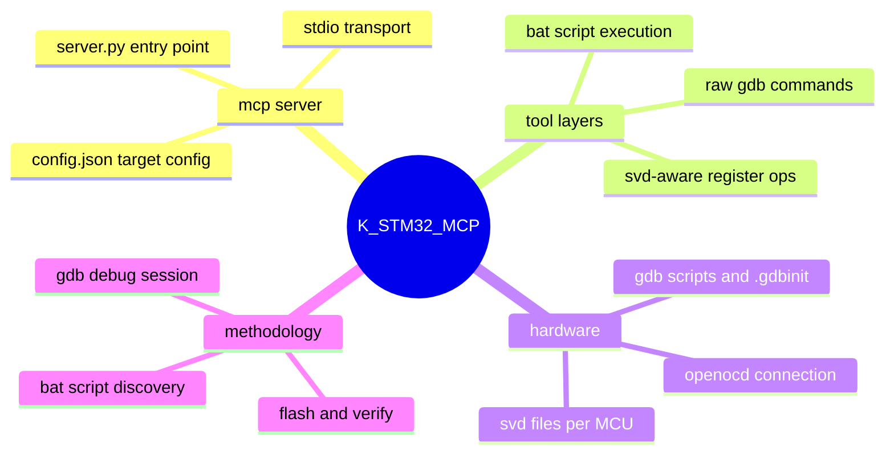

# K_STM32_MCP Mindmap Subtree

```mermaid
mindmap
  root((K_STM32_MCP))
    mcp server
      server.py entry point
      stdio transport
      config.json target config
    tool layers
      raw gdb commands
      svd-aware register ops
      bat script execution
    hardware
      svd files per MCU
      gdb scripts and .gdbinit
      openocd connection
    methodology
      gdb debug session
      flash and verify
      bat script discovery
```
